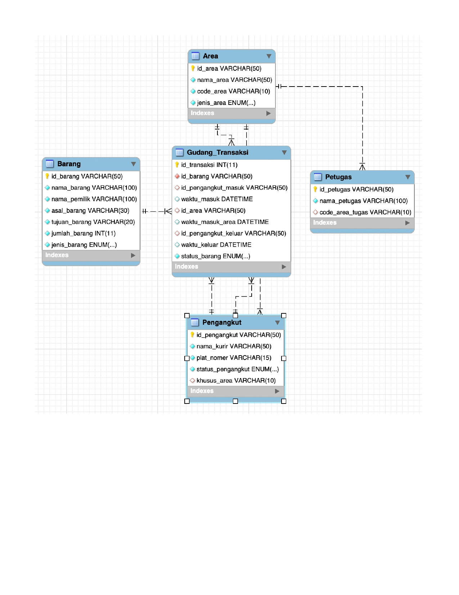
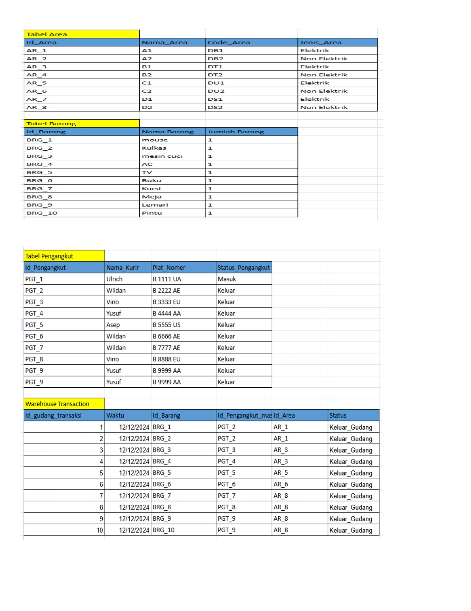
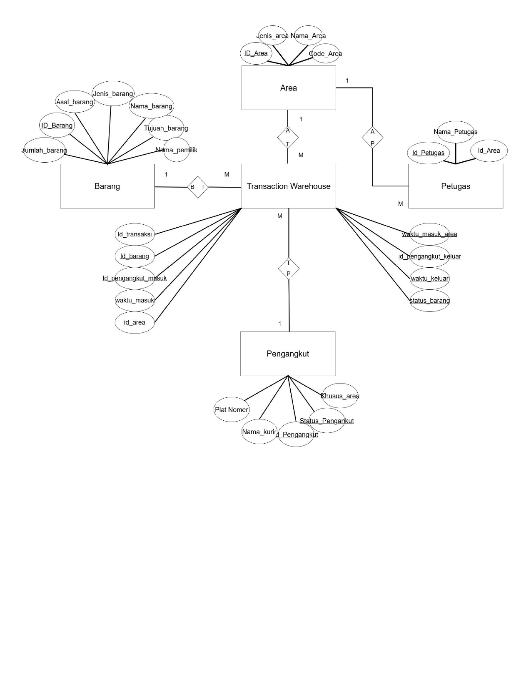

# Warehouse Database

A database design project that models a warehouse management system through the complete database design process, including Entity Relationship Diagram (ERD), Third Normal Form (3NF), and Relational Schema.

---

## Database Design

### Entity Relationship Diagram (ERD)

The ERD defines the relationships between warehouse entities such as products, suppliers, customers, transactions, and inventory.

---

### Third Normal Form (3NF)

The database was normalized to Third Normal Form (3NF) to reduce redundancy while maintaining data integrity and consistency.

---

### Relational Schema

The relational schema translates the ERD into a database structure consisting of related tables, primary keys, and foreign keys.

---

## Project Goal

The objective of this project is to design a structured warehouse database capable of supporting inventory management and transaction processing while following fundamental database normalization principles.

---

## Design Process

The database was developed through three main stages:

- Designing the Entity Relationship Diagram (ERD)
- Applying normalization up to Third Normal Form (3NF)
- Converting the design into a relational schema

---

## Files

- `Warehouse_Database.pdf` — Project documentation
- `images/` — ERD, normalization, and relational schema diagrams

---

## Authors

- Aldi Syarif Alhakim
- Alezuna M. Nadhif Pohan
- Muhamad Ihsad Rasyad
